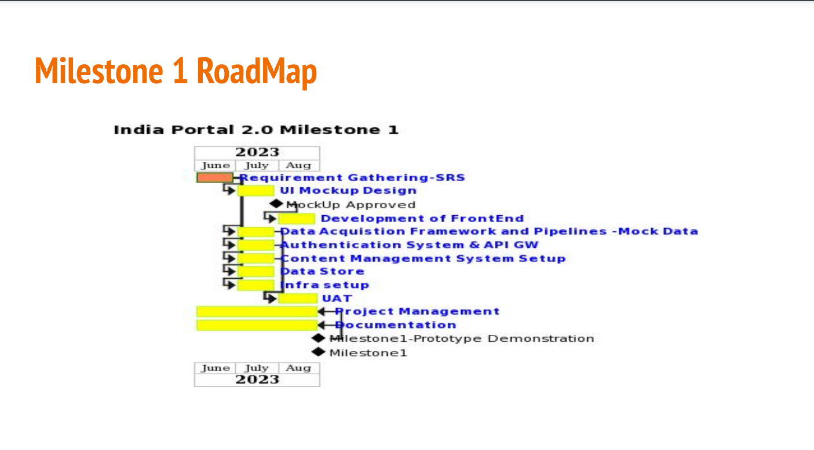
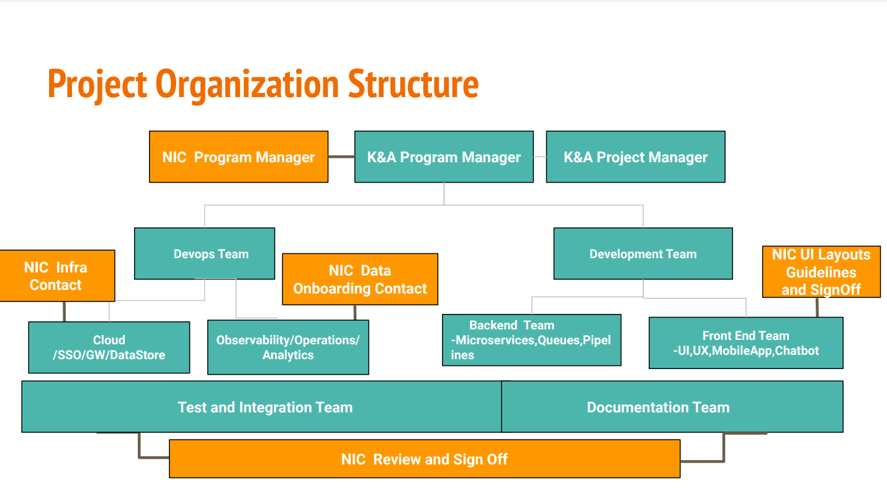

#
### India Portal 2.0
Project Review Meeting for june 2023
K&A team 5 july 2023

# 
### Agenda
+ Milestone 1 Scope of Work
+ Data Analysis
+ Current Project Team Organization
+ SW Architecture View
+ Going forward
+ A glimpse of future milestones

# 

  
Scope of Work

Understanding of the Project

# 
<h3>Milestone</h3>

#
<h3>Milestone 1 RoadMap</h3>

# 

  
<h2>Milestone1</h2>
Requirement Analysis

Theme Prototype Ready

# 
<h3>Requirement Gathering...Data Source Analysis..1/2</h3>

Total Data Source : 23

Not available : 8 

Available and Analysed : 15

# 
## Data Source:API Not available
<h3>Data Source:API Not available</h3>
<table>
<tr>
<td>S.No.</td>
<td>Component</td>
<td>Sources</td>
<td>Remarks</td>
</tr>
<tr>
<td>1</td>
<td>services</td>
<td>Various Digital services Delivery   Portals/Applications(Umang,Service Pus,NGSP etc)</td>
<td>through APIs</td>
</tr>
<tr>
    <td>2</td>
    <td>schemes</td>
    <td>Platforms like Haqdarshak, EasyGov,Schemopedia,  Digital Empowerment Foundation,etc   Portals/Applications(Umang,Service Pus,NGSP etc)</td>
    <td>One Platform would be selected for integration, through APIs</td>
</tr>
<tr>
    <td>3</td>
    <td>infographics</td>
    <td>MyGov,DataGov,PIB</td>
    <td>thorough APIs</td>
</tr>
<tr>
    <td>4</td>
    <td>news</td>
    <td>PIB,DDNews,NewsonAir etc</td>
    <td>through APIs and RSS Feeds</td>
</tr>
<tr>
    <td>5</td>
    <td>webcasts</td>
    <td>webcast.gov.in</td>
    <td>through APIs</td>
</tr>
<tr>
    <td>6</td>
    <td>state contact directory</td>
    <td>S3Waas</td>
    <td>State level contact directory will be created as and when the departments onboard,through APIs</td>
</tr>
<tr>
    <td>7</td>
    <td>acts and rules</td>
    <td>indiacode.nic.in</td>
    <td>through APIs</td>
</tr>
<tr>
    <td>8</td>
    <td>Visualization</td>
    <td>DataGov</td>
    <td>through APIs</td>
</tr>
</table>

#
<h3>Data Source:API analysed...2/2</h3>
<table>
<tr>
<td>S.No.</td>
<td >Component</td>
<td >Source</td>
<td >Mode</td>
<td >Search API</td>
<td >Reference website</td>
<td >K&A Remarks</td>
</tr>
<tr >
<td>7</td>
<td>ecourts contact   directory  (judges)</td>
<td>S3WaaS</td>
<td>through APIs</td>
<td>Make at NPI</td>
<td>https://ecourts.gov.in/</td>
<td>Available and being analysed </td>
</tr>
<tr>
    <td>8</td>
    <td>knowindia-   tourist places</td>
    <td>S3WaaS</td>
    <td>through APIs</td>
    <td>Make at NPI</td>
    <td>https://aliraipr.nic.in/en/tourist-places</td>
    <td>Available and Analysed </td>
</tr>
<tr>
    <td>9</td>
    <td>knowindia-   accomodation</td>
    <td>S3WaaS</td>
    <td>through APIs</td>
    <td>Make at NPI</td>
    <td>https://agra.nic.in/acco   modation/html/https://alir   aipr.nic.in/en/where-t   o-stay</td>
    <td>Available and Analysed </td>
</tr>
<tr>
    <td>10</td>
    <td>knowindia-   photo gallary</td>
    <td>S3WaaS</td>
    <td>through APIs</td>
    <td>Make at NPI</td>
    <td>https://agra.nic.in/acco   modation/html/https://alir   aipr.nic.in/en/where-t   o-stay</td>
    <td>Available and Analysed </td>
</tr>
<tr>
    <td>11</td>
    <td>knowindia-   photo gallary</td>
    <td>S3WaaS</td>
    <td>through APIs</td>
    <td>Make at NPI</td>
    <td>https://agra.nic.in/acco   modation/html/https://alir   aipr.nic.in/en/where-t   o-stay</td>
    <td>Available and Analysed </td>
</tr>
<tr>
    <td>12</td>
    <td>knowindia-   produce</td>
    <td>S3WaaS</td>
    <td>through APIs</td>
    <td>Make at NPI</td>
    <td>https://agra.nic.in/acco   modation/html/https://alir   aipr.nic.in/en/where-t   o-stay</td>
    <td>Available and Analysed </td>
</tr>
<tr>
    <td>13</td>
    <td>knowindia-   helpline</td>
    <td>S3WaaS</td>
    <td>through APIs</td>
    <td>Make at NPI</td>
    <td>https://agra.nic.in/acco   modation/html/https://alir   aipr.nic.in/en/where-t   o-stay</td>
    <td>Available and Analysed </td>
</tr>
<tr>
    <td>14</td>
    <td>knowindia-   public utilities</td>
    <td>S3WaaS</td>
    <td>through APIs</td>
    <td>Make at NPI</td>
    <td>https://agra.nic.in/acco   modation/html/https://alir   aipr.nic.in/en/where-t   o-stay</td>
    <td>Available and Analysed </td>
</tr>
<tr>
    <td>15</td>
    <td>blogs</td>
    <td>MyGov,  DataGov</td>
    <td>through APIs</td>
    <td></td>
    <td>https://agra.nic.in/acco   modation/html/https://alir   aipr.nic.in/en/where-t   o-stay</td>
    <td>Available and Analysed. Findings shared with Pankaj/Ravi </td>
</tr>
</table>

#
<h3>Data Source: Summary</h3>
<ol>
  <li>Classification of data into master and transactional
     <ol style="list-style-type: lower-alpha;" >
       Master
       <li>The data which is largely static like state list, district list,ministry list</li> 
       <ol style="list-style-type: lower-roman;">
       Transactional
       <li  >The data which changes quite often like Lok Sabha/Rajya Sabha members,who'who,judges etc</li>
    </ol>
    </ol>
  </li>
  <li>
  Conflicting masters
   <ol style="list-style-type: lower-alpha;">
     <li>
     which master IGOD or S3WAAS to refer for state and district list?
     </li>
   </ol>
  </li>
</ol>

# 
<h3>Design Approach</h3>

First Ingest Master Data

Resolve conflicts between Masters

Link to ingested masters while ingested masters while ingesting transactional dta

# 

  
<h2>S3WAAS</h2>
Data Analysis

#
<h3>Data Source:Findings(S3WAAS)..1/2</h3>
<table>
 <tr>
   <td>#</td>
   <td>S3WAAS API</td>
   <td>Proposed facets of search</td>
   <td>free text search</td>
   <td>Nature</td>
   <td>Remarks</td>
 </tr>
 <tr>
   <td>1.</td>
   <td>state list</td>
   <td></td>
   <td></td>
   <td>Master</td>
   <td>Conflicts with IGOD state master</td>
 </tr>
<tr>
   <td>2.</td>
   <td>District list</td>
   <td>stateName</td>
   <td></td>
   <td>Master</td>
   <td>Conflicts with IGOD district master</td>
 </tr>
 <tr>
   <td>3.</td>
   <td>district who is who</td>
   <td>StateName,districtName,category,designation</td>
   <td>Name(Title)</td>
   <td>Transactional</td>
   <td>Duplication of content between who'who and Directory List</td>
 </tr>
 <tr>
   <td>4.</td>
   <td>district contact directory</td>
   <td>StateName,districtName,category,designation</td>
   <td>Name(Title)</td>
   <td>transactionalr</td>
   <td>Duplication of content between who'who and Directory List</td>
 </tr>
 <tr>
   <td>5.</td>
   <td>state category directory</td>
   <td></td>
   <td></td>
   <td>Transactionalr</td>
   <td>Not available</td>
 </tr>
 <tr>
   <td>6.</td>
   <td>ecourts contact directory(judges) </td>
   <td></td>
   <td></td>
   <td>Transactional</td>
   <td>Under Analysis</td>
 </tr>
 <tr>
   <td>7.</td>
   <td>ecourts contact directory(judges) </td>
   <td></td>
   <td></td>
   <td>Transactional</td>
   <td>Under Analysis</td>
 </tr>
 <tr>
   <td>8.</td>
   <td>ecourts contact directory(judges) </td>
   <td></td>
   <td></td>
   <td>Transactional</td>
   <td>Under Analysis</td>
 </tr>
 </table>

 #
<h3>Data Source:Findings(S3WAAS)..1/2</h3>
<table>
 <tr>
   <td>#</td>
   <td>S3WAAS API</td>
   <td>Proposed facets of search</td>
   <td>free text search</td>
   <td>Nature</td>
   <td>Remarks</td>
 </tr>
 <tr>
   <td>9.</td>
   <td>state list</td>
   <td></td>
   <td></td>
   <td>Master</td>
   <td>Conflicts with IGOD state master</td>
 </tr>
<tr>
   <td>10.</td>
   <td>District list</td>
   <td>stateName</td>
   <td></td>
   <td>Master</td>
   <td>Conflicts with IGOD district master</td>
 </tr>
 <tr>
   <td>11.</td>
   <td>district who is who</td>
   <td>StateName,districtName,category,designation</td>
   <td>Name(Title)</td>
   <td>Transactional</td>
   <td>Duplication of content between who'who and Directory List</td>
 </tr>
 <tr>
   <td>12.</td>
   <td>district contact directory</td>
   <td>StateName,districtName,category,designation</td>
   <td>Name(Title)</td>
   <td>transactionalr</td>
   <td>Duplication of content between who'who and Directory List</td>
 </tr>
 <tr>
   <td>13.</td>
   <td>state category directory</td>
   <td></td>
   <td></td>
   <td>Transactionalr</td>
   <td>Not available</td>
 </tr>
 </table>

 # 

  
<h2>IGOD</h2>
Data Analysis

 #
<h3>Data Source:Findings(IGOD)..1/2</h3>
<table>
 <tr>
   <td>#</td>
   <td>IGOD API</td>
   <td>Proposed facets of search</td>
   <td>free text search</td>
   <td>Nature</td>
   <td>Remarks</td>
 </tr>
 <tr>
   <td>1.</td>
   <td>state list</td>
   <td></td>
   <td></td>
   <td>Master</td>
   <td>Conflicts with IGOD state master</td>
 </tr>
<tr>
   <td>2.</td>
   <td>District list</td>
   <td>stateName</td>
   <td></td>
   <td>Master</td>
   <td>Conflicts with IGOD district master</td>
 </tr>
 <tr>
   <td>3.</td>
   <td>district who is who</td>
   <td>StateName,districtName,category,designation</td>
   <td>Name(Title)</td>
   <td>Transactional</td>
   <td>Duplication of content between who'who and Directory List</td>
 </tr>
 <tr>
   <td>4.</td>
   <td>district contact directory</td>
   <td>StateName,districtName,category,designation</td>
   <td>Name(Title)</td>
   <td>transactionalr</td>
   <td>Duplication of content between who'who and Directory List</td>
 </tr>
 <tr>
   <td>5.</td>
   <td>state category directory</td>
   <td></td>
   <td></td>
   <td>Transactionalr</td>
   <td>Not available</td>
 </tr>
 <tr>
   <td>6.</td>
   <td>state category directory</td>
   <td></td>
   <td></td>
   <td>Transactionalr</td>
   <td>Not available</td>
 </tr>
 <tr>
   <td>7.</td>
   <td>state category directory</td>
   <td></td>
   <td></td>
   <td>Transactionalr</td>
   <td>Not available</td>
 </tr>
 <tr>
   <td>8.</td>
   <td>state category directory</td>
   <td></td>
   <td></td>
   <td>Transactionalr</td>
   <td>Not available</td>
 </tr>
 </table>

#
<h3>Data Source:Findings(IGOD)..2/2</h3>
<table>
 <tr>
   <td>#</td>
   <td>IGOD API</td>
   <td>Proposed facets of search</td>
   <td>free text search</td>
   <td>Nature</td>
   <td>Remarks</td>
 </tr>
 <tr>
   <td>1.</td>
   <td>state list</td>
   <td></td>
   <td></td>
   <td>Master</td>
   <td>Conflicts with IGOD state master</td>
 </tr>
<tr>
   <td>2.</td>
   <td>District list</td>
   <td>stateName</td>
   <td></td>
   <td>Master</td>
   <td>Conflicts with IGOD district master</td>
 </tr>
 </table>

 # 

  
<h2>SANSAD</h2>
Data Analysis

#
<h3>Data Source: sansad Findings()..1</h3>
<table>
 <tr>
   <td>#</td>
   <td>API</td>
   <td>Proposed facets of search</td>
   <td>free text search</td>
   <td>Nature</td>
   <td>Remarks</td>
 </tr>
 <tr>
   <td>1.</td>
   <td>state list</td>
   <td></td>
   <td></td>
   <td>Master</td>
   <td>Conflicts with IGOD state master</td>
 </tr>
<tr>
   <td>2.</td>
   <td>District list</td>
   <td>stateName</td>
   <td></td>
   <td>Master</td>
   <td>Conflicts with IGOD district master</td>
 </tr>
 </table>

#
## Frontend Activities being done so far
<ul style="list-style:disc">
<li>A faceted search prototype is develped and demonstrated for s3waas who's who</li>
<li>CMS use cases</li>
<ul style="list-style:square">
<li>Tag workflow requiring approval by moderator</li>
<li>Tag workflow without approval(unmoderated)</li>
<li>Masters tables</li>
</ul>
</ul>

Upcoming

UI MockUps(Landing page)

CMS use case

#
### CMS use cases
#### Functional Requirements
###### newsletters
###### MetaData Section(SEO)
###### content for National Celebrations (Republic day and Independence day)
###### spotlights 
###### page management(for pages like contact us, about us etc) and Pages based on user profiling 
###### adding custom attributes to the data like Tags,
###### Audit management in Strapi(perhaps available in enterprise version)
###### API integration
###### adding People Group

 

### Non Functional Requirements
##### Third party authentication implementation using keycloak.
##### User role based management CMS.
##### Group user for api allowance.
##### Deploy using Docker/kubernates.
##### Multiple instances of strpi.
##### Dashboards
##### Pipeline Workflow(like source of each pipeline..)

# 
## Overview of pipeline for one API of one source

#
## Backend Activities Done so far
1. IGOD state pipeline
+ IGOD state data acquisition task, data mapper task
2. Prototyping ongoing for a generic data store pipeline using topics and kafka connect
### Next
1. S3WAAS state pipeline
-Write S3WAAS state data acquisition pipeline, data mapper,
2. Test S3WAAS state pipeline and IGOD state pipeline and see there are no conflicts with respect to start sequence

# 
## Devops Activities being so far 

Activities

<ul>
  <li>HW requirements shared</li>
  <li>DB prototyping</li>
  <li>
    <ul>
      <li>A mock data set of 1 lac records created</li>
      <li>Testing ongoing in postgres for:</li>
      <ul style="list-style:square">
        <li>Facet search</li>
        <li>Partitioning(horizontal and vertical)</li>
        <li>Free text search</li>
        <li>Field level access control</li>
      </ul>
    </ul>
  </li>
</ul>

#
## Milestone 1 Items Summary..1/2
<table>
<tr>
  <td>Item</td>
  <td>Status</td>
  <td>Remarks</td>
</tr>
<tr>
  <td>Requirements Gathering</td>
  <td>Ongoing</td>
  <td>SRS/Data Analysis/Architecture</td>
</tr>
<tr>
  <td>UI Mockups</td>
  <td>Ongoing</td>
  <td>Need to converge on UI landing page and navigation</td>
</tr>
<tr>
  <td>Data Acquisition Framework and Pipeline</td>
  <td>Ongoing</td>
  <td></td>
</tr>
<tr>
  <td>Authentication System and API GW</td>
  <td>Not Started</td>
  <td></td>
</tr>
<tr>
  <td>CMS setup</td>
  <td>Ongoing</td>
  <td></td>
</tr>
<tr>
  <td>Infra Setup</td>
  <td>Not Started</td>
  <td></td>
</tr>
<tr>
  <td>Datastore setup</td>
  <td>Not Started</td>
  <td></td>
</tr>
<tr>
  <td>Prototype Demonstration</td>
  <td>Ongoing </td>
  <td>Would need a use case that stakeholders would like to see</td>
</tr>
</table>

# 
## Milestone 1 Items Summary..1/2
<table>
<tr>
  <td>Item</td>
  <td>Status</td>
  <td>Remarks</td>
</tr>
<tr>
  <td>Project Management</td>
  <td>Ongoing</td>
  <td></td>
</tr>
<tr>
  <td>Documentation</td>
  <td>Ongoing</td>
  <td></td>
</tr>
</table> 

#

  
<h3>Current Project Team Organization</h3>

 <h6>Team Composition</h6> 

#
## Team Composition 
<table>
<tr>
  <td>Item</td>
  <td>Status</td>
  <td>Remarks</td>
</tr>
<tr>
  <td>Requirements Gathering</td>
  <td>Ongoing</td>
  <td>SRS/Data Analysis/Architecture</td>
</tr>
<tr>
  <td>UI Mockups</td>
  <td>Ongoing</td>
  <td>Need to converge on UI landing page and navigation</td>
</tr>
<tr>
  <td>Data Acquisition Framework and Pipeline</td>
  <td>Ongoing</td>
  <td></td>
</tr>
<tr>
  <td>Authentication System and API GW</td>
  <td>Not Started</td>
  <td></td>
</tr>
<tr>
  <td>CMS setup</td>
  <td>Ongoing</td>
  <td></td>
</tr>
<tr>
  <td>Infra Setup</td>
  <td>Not Started</td>
  <td></td>
</tr>
<tr>
  <td>Datastore setup</td>
  <td>Not Started</td>
  <td></td>
</tr>
<tr>
  <td>Prototype Demonstration</td>
  <td>Ongoing </td>
  <td>Would need a use case that stakeholders would like to see</td>
</tr>
</table>

#
## Milestone 1 Items Summary..1/2
<table>
<tr>
  <td>Role</td>
  <td>K&A contact</td>
  <td>NIC Contact</td>
</tr>
<tr>
  <td>Program Manager</td>
  <td>Nity Gupta</td>
  <td>Lokesh Sir</td>
</tr>
<tr>
  <td>Project Manager</td>
  <td>Monika Verma</td>
  <td>Lokesh sir/Pankaj</td>
</tr>
<tr>
  <td>Development Lead</td>
  <td>Varad Gupta</td>
  <td></td>
</tr>
<tr>
  <td>FrontEnd Team</td>
  <td>Deepak Negi/Farhan</td>
  <td></td>
</tr>
<tr>
  <td>Backend Team</td>
  <td>Adarsh Verma/Barsha/Jai</td>
  <td>Pankaj/Mansi/Rakesh/Sandeep</td>
</tr>
<tr>
  <td>DevOps Team</td>
  <td>Neeraj Yadav/Paul</td>
  <td></td>
</tr>
<tr>
  <td>CMS Lead</td>
  <td>Manoj Mahanta</td>
  <td></td>
</tr>
<tr>
  <td>Document Lead</td>
  <td>Monika Verma</td>
  <td></td>
</tr>
<tr>
  <td>Tested Lead</td>
  <td>Kapil Jain</td>
  <td></td>
</tr>
</table>

# 
### Project Organization Structure

# 

  
<h2>Thank you</h2>

